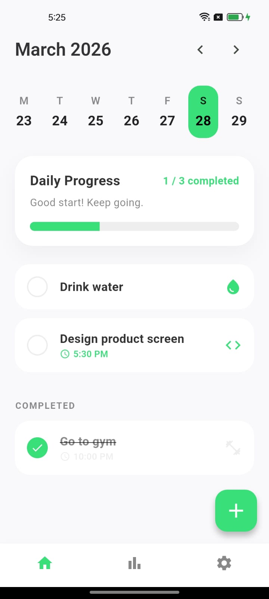
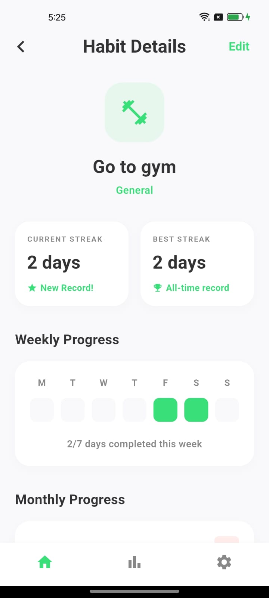
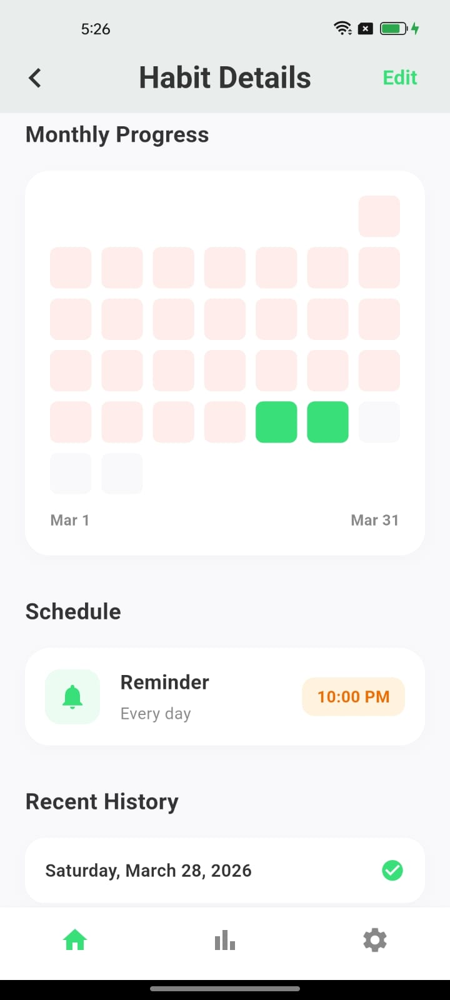
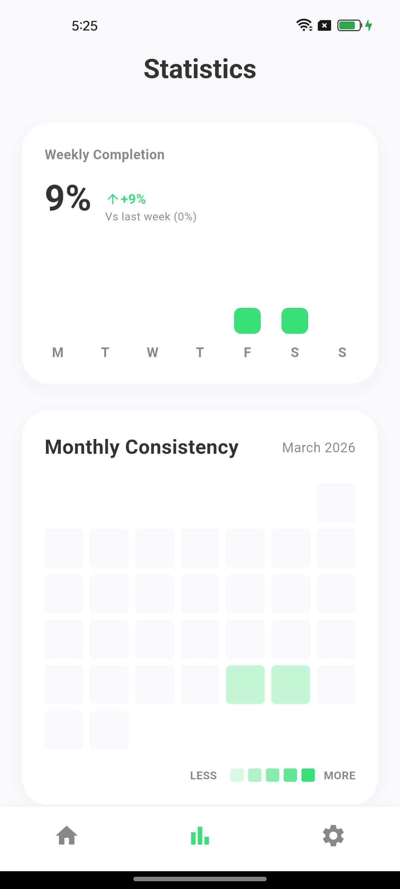
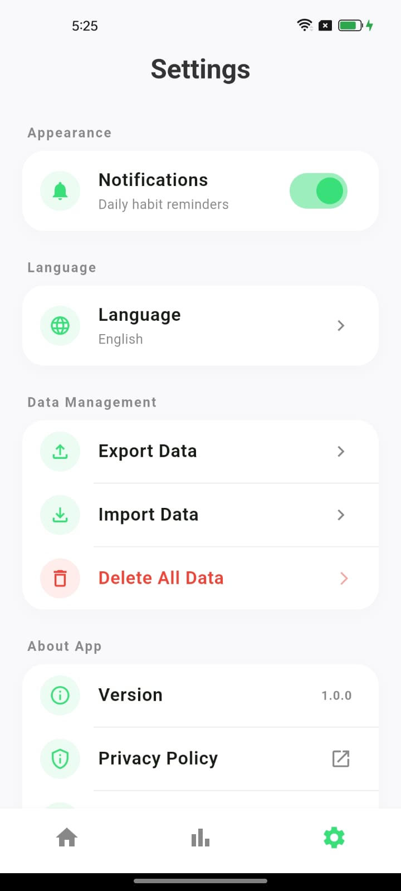
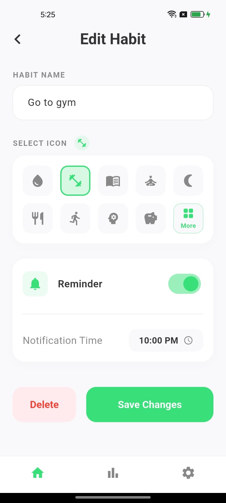
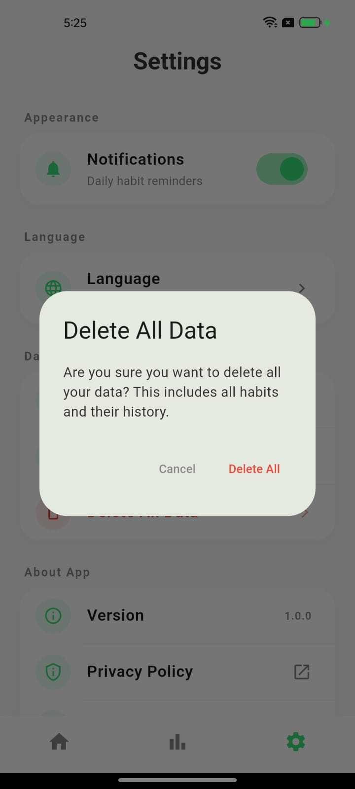

# habit_tracker_app

📱 HabitTap – Habit Tracker App

A clean, minimal, and offline-first habit tracking app built with Flutter.

HabitTap helps users build and maintain daily habits with a simple and distraction-free experience — no login, no backend, no data collection.

<p align="center">
  
  
  
  
  
  
  
</p>

## ✨ Features

- ✅ Create, update, and delete habits (Full CRUD)
- 🔁 Daily habit tracking with completion toggle  

### 📊 Visual Progress Tracking
- Weekly & monthly heatmaps  
- Current streak & best streak  

- 📈 Global statistics dashboard  

### ⚙️ Settings
- Multi-language support  
- Notification toggle  
- JSON backup (import/export)  
- Full data reset  

- 🔒 100% offline (no backend, no authentication)

---

## 🛠 Tech Stack

- Flutter (Dart)  
- Riverpod (State Management)  
- Hive (Local Database)  
- Material 3 UI  

## 📦 Installation

```bash
git clone https://github.com/raheeldevninja/habit_tap.git
cd habit_tap
flutter pub get
flutter run

🤝 Contributing

Contributions are welcome! Feel free to open issues or submit pull requests.

⭐ Support

If you like this project, consider giving it a ⭐ on GitHub!


